# 🗺️ NeuralVault Backend — Dependency Graph & Module Map

> **Generated:** 2026-06-15 | **Purpose:** Visualise which modules depend on which, to aid debugging and refactoring.

---

## Module Dependency Graph

```mermaid
graph TD
    subgraph "Entry Point"
        MAIN["main.py"]
    end

    subgraph "API Layer"
        R_DOC["routes/document.py"]
        R_ING["routes/ingest.py"]
        R_QRY["routes/query.py"]
        R_CFG["routes/config.py"]
        R_SET["routes/setting.py (dead)"]
        R_HLT["routes/health.py"]
    end

    subgraph "Service Layer"
        S_DOC["services/document_service.py"]
        S_ING["services/ingestion_service.py"]
        S_RET["services/retrieval_service.py"]
        S_MET["services/metadata_service.py"]
        S_CFG["services/config_service.py"]
    end

    subgraph "RAG Pipeline"
        RAG_IP["rag/ingestion_pipeline.py"]
        RAG_RP["rag/retrieval_pipeline.py"]
        RAG_LLM["rag/llm_service.py"]
        RAG_BM25["rag/bm25_retriever.py"]
        RAG_META["rag/metadata_enricher.py"]
    end

    subgraph "Data Layer"
        DB["db/database.py"]
        SCH_DOC["schemas/document_schema.py"]
        SCH_CFG["schemas/config_schema.py"]
        SCH_SET["schemas/setting_schema.py"]
    end

    subgraph "Models (DTOs)"
        M_DOC["models/document_model.py"]
        M_CFG["models/config_model.py"]
        M_QRY["models/query_model.py"]
        M_SET["models/setting_model.py"]
    end

    subgraph "Utilities"
        U_EMB["utils/embeddings.py"]
        U_CHR["utils/chroma_client.py"]
        U_QDR["utils/qdrant_client.py"]
        U_SAV["utils/save_file.py"]
    end

    subgraph "Core"
        CFG["core/config.py (Settings)"]
    end

    subgraph "External"
        EXT_PG[("PostgreSQL (Neon)")]
        EXT_QD[("Qdrant Cloud")]
        EXT_GQ[("Groq API")]
        EXT_HF[("HuggingFace")]
        EXT_FS[("File System")]
    end

    %% Entry point → Routers
    MAIN --> R_DOC
    MAIN --> R_ING
    MAIN --> R_QRY
    MAIN --> R_CFG
    MAIN --> R_HLT
    MAIN --> DB
    MAIN --> CFG

    %% Routes → Services
    R_DOC --> S_DOC
    R_ING --> S_ING
    R_QRY --> S_RET
    R_CFG --> S_CFG
    R_SET --> M_SET

    %% Routes → DB
    R_DOC --> DB
    R_ING --> DB
    R_QRY --> DB
    R_CFG --> DB
    R_SET --> DB

    %% Routes → Models
    R_CFG --> M_CFG
    R_QRY --> M_QRY

    %% Services → RAG
    S_ING --> RAG_IP
    S_ING --> U_SAV
    S_RET --> RAG_RP
    S_RET --> RAG_LLM
    S_RET --> S_CFG

    %% Services → Schemas (ORM)
    S_DOC --> SCH_DOC
    S_MET --> SCH_DOC
    S_CFG --> SCH_CFG
    S_DOC --> U_CHR
    S_DOC --> RAG_BM25

    %% RAG → Utils
    RAG_IP --> U_QDR
    RAG_IP --> RAG_META
    RAG_IP --> RAG_BM25
    RAG_IP --> S_MET
    RAG_RP --> U_QDR
    RAG_LLM --> CFG

    %% Utils → Core
    U_EMB --> CFG
    U_CHR --> CFG
    U_CHR --> U_EMB
    U_QDR --> CFG
    U_QDR --> U_EMB
    U_SAV --> CFG

    %% Utils → External
    U_QDR --> EXT_QD
    U_EMB --> EXT_HF
    U_SAV --> EXT_FS
    RAG_LLM --> EXT_GQ
    DB --> EXT_PG
    RAG_BM25 --> EXT_FS
```



---

## Import Chain for Key Flows

### Ingestion Flow Import Chain

```
main.py
  └─ app.api.routes.ingest
       └─ app.services.ingestion_service
            ├─ app.utils.save_file
            │    └─ app.core.config
            └─ app.rag.ingestion_pipeline
                 ├─ app.utils.qdrant_client
                 │    ├─ app.core.config
                 │    └─ app.utils.embeddings
                 │         └─ app.core.config
                 ├─ app.rag.metadata_enricher  (no dependencies)
                 ├─ app.rag.bm25_retriever     (no app dependencies)
                 └─ app.services.metadata_service
                      ├─ app.schemas.document_schema
                      │    └─ app.db.database
                      │         └─ app.core.config
                      └─ app.db.database
```

### Query Flow Import Chain

```
main.py
  └─ app.api.routes.query
       ├─ app.models.query_model  (no dependencies)
       └─ app.services.retrieval_service
            ├─ app.rag.retrieval_pipeline
            │    ├─ app.utils.qdrant_client
            │    │    ├─ app.core.config
            │    │    └─ app.utils.embeddings
            │    └─ app.core.config
            ├─ app.rag.llm_service
            │    └─ app.core.config
            └─ app.services.config_service
                 ├─ app.models.config_model
                 └─ app.schemas.config_schema
                      └─ app.db.database
```

---

## Cross-Cutting Concerns Map

| Concern | Files Involved | Pattern Used |
|---------|---------------|-------------|
| **DB Session** | `database.py` → all routes via `Depends(get_db_session)` | Generator-based DI |
| **Settings** | `config.py` → every module (11 instantiations) | ⚠️ Should be singleton import |
| **Embeddings** | `embeddings.py` → `qdrant_client.py`, `chroma_client.py` | Factory function |
| **Error Handling** | Every file individually | `try/except/print/raise` |
| **Status Tracking** | `metadata_service.py` ← `ingestion_pipeline.py` | DB updates at each stage |

---

## Circular Dependency Check

✅ **No circular dependencies found.** The dependency graph is a clean DAG (Directed Acyclic Graph).

### Potential Risk Areas

1. `services/document_service.py` → `utils/chroma_client.py` → `utils/embeddings.py`
   - If embeddings ever depends on a service, this would create a cycle
   
2. `services/metadata_service.py` imports `db/database.py::get_db_session` but doesn't use it
   - Unnecessary import, but not harmful

---

## External Service Dependency Map

```
┌──────────────────────────────────────────────────────────────┐
│                    NeuralVault Backend                        │
│                                                              │
│  ┌─────────┐    ┌──────────┐    ┌──────────┐    ┌────────┐ │
│  │ Qdrant  │    │PostgreSQL│    │  Groq    │    │  HF    │ │
│  │ Client  │    │ Session  │    │  LLM     │    │ Models │ │
│  └────┬────┘    └────┬─────┘    └────┬─────┘    └───┬────┘ │
│       │              │               │              │       │
└───────┼──────────────┼───────────────┼──────────────┼───────┘
        │              │               │              │
        ▼              ▼               ▼              ▼
  ┌──────────┐  ┌──────────┐  ┌──────────────┐  ┌─────────┐
  │ Qdrant   │  │ Neon DB  │  │ Groq Cloud   │  │HuggingFace│
  │ Cloud    │  │ (Postgres│  │ (Llama 3.1)  │  │ Hub       │
  │          │  │  15+)    │  │              │  │           │
  │ Port: 443│  │ Port: 5432│ │ Port: 443   │  │ Port: 443 │
  └──────────┘  └──────────┘  └──────────────┘  └───────────┘

  Required for:   Required for:  Required for:   Required for:
  - Ingestion     - All routes   - POST /query   - Embedding
  - Retrieval     - Status track - LLM answers   - On import
  - Vector search - Config CRUD                    (model download)
```

### Failure Impact Analysis

| Service Down | Impact | Endpoints Affected | Graceful Handling? |
|-------------|--------|-------------------|-------------------|
| PostgreSQL | 💀 Fatal | ALL | ❌ No — unhandled crash |
| Qdrant Cloud | ⚡ Partial | /ingest, /query | 🟡 Catches exception, returns error string |
| Groq API | ⚡ Partial | /query | 🟡 Catches exception, returns error string |
| HuggingFace | 💀 Fatal | /ingest, /query | ❌ No — model load fails at import time |
| File System | ⚡ Partial | /ingest | 🟡 FileNotFoundError raised |
